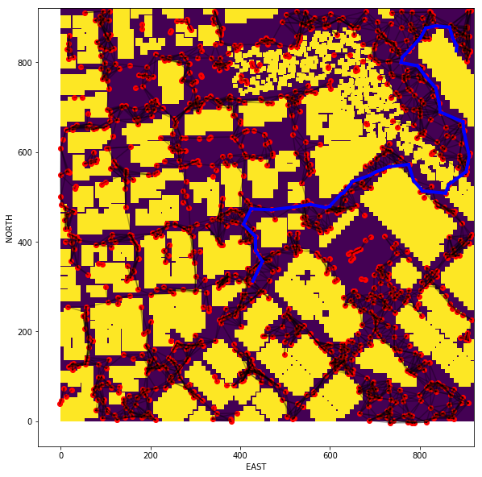
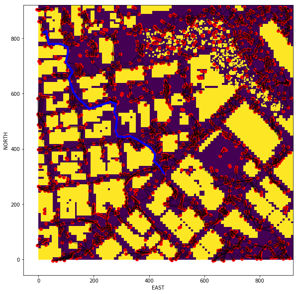
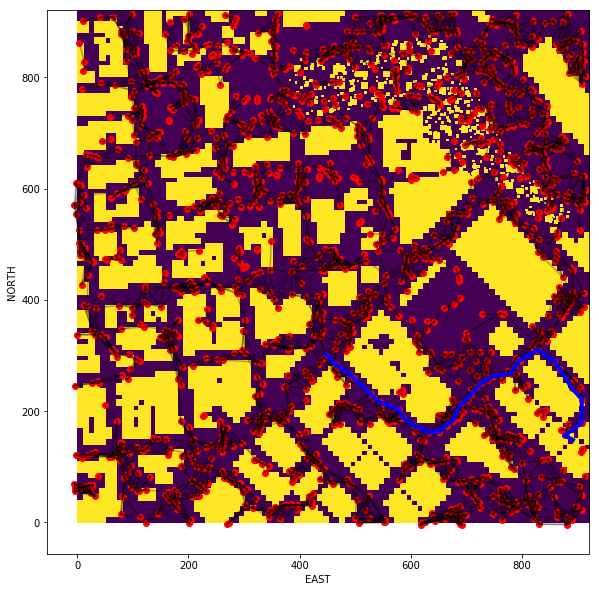
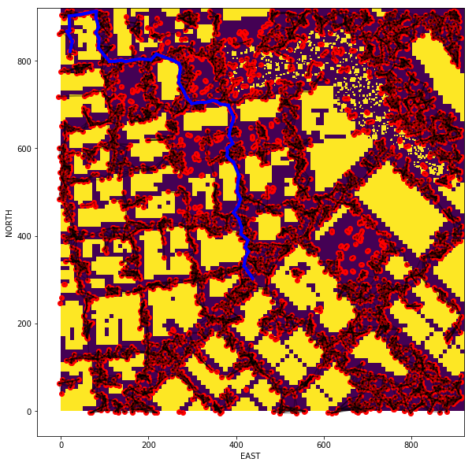

# FCND-Term1-P2-3D-Motion-Planning 

This is the second project on Udacity's Flying Car Nanodegree. The code consists of planning and executing a trajectory of a drone in an urban environment. 

---

# Project description


# Required Steps for a Passing Submission:
1. Load the 2.5D map in the colliders.csv file describing the environment.
2. Discretize the environment into a grid or graph representation.
3. Define the start and goal locations.
4. Perform a search using A* or other search algorithm.
5. Use a collinearity test or ray tracing method (like Bresenham) to remove unnecessary waypoints.
6. Return waypoints in local ECEF coordinates (format for `self.all_waypoints` is [N, E, altitude, heading], where the drone’s start location corresponds to [0, 0, 0, 0].
7. Write it up.
8. Congratulations!  Your Done!

## [Rubric](https://review.udacity.com/#!/rubrics/1534/view) Points
### Here I will consider the rubric points individually and describe how I addressed each point in my implementation.  

---
### Writeup / README

### Explain the Starter Code

#### 1. Explain the functionality of what's provided in `motion_planning.py` and `planning_utils.py`
*'planning_utili.py'* is called by *'motion_planning.py'* and provides the following functionallities upon request:

  a. 'create_grid' function:  Returns a grid representation of a 2D configuration space  based on given obstacle data, 
                              drone altitude and safety distance arguments.
                                 
  b. 'Action' class:          Defines the valid motion actions and assigns cost and distance traveled associated with each
                              action to the action.
                              
  c. 'a_star' function:       Given a grid and heuristic function returns the lowest cost path from start to goal.    
  
          
*'motion_planning.py'* uses 'udacidrone API' to communicate with the drone/or simulator and ultimately initiate the flight. 


### Implementing Your Path Planning Algorithm

#### 1. Set your global home position

The home position is read at motion_planning.py line 165. It use the function read_home added to planning_utils.py

#### 2. Set your current local position

global_to_local() function is called to transform the drones current global position into local position. planning_utils.py line XXX.

#### 3. Set grid goal position from geodetic coords

global_to_local() function is called to transform any desired (lat, lon) coordination into a local goal position. 
planning_utils.py line XXX.

#### 5. Modify A* to include diagonal motion (or replace A* altogether)

In this project, I modified 'Action' class (planning_utils.py line XXX to YYY) and 'valid_actions' function (planning_utils.py line XXX to YYY) to incorporate diagonal motion. However, since I used "Probabilistic Roadmap" method to disretize the space into graph the diagonal motion functionallity was not used. 

I replaced the A* function to be able to work with a non-uniform graph (planning_utils.py line XXX to YYY) and 

#### 6. Cull waypoints 
For this step you can use a collinearity test or ray tracing method like Bresenham. The idea is simply to prune your path of unnecessary waypoints. Explain the code you used to accomplish this step.


### Execute the flight
#### 1. Does it work?
It works!

A few examples of flight to random goals:


```
Home lat : 37.79248, lon : -122.39745
Global Home     => [lon, lat, alt]     : [-122.39745, 37.79248, 0]
Global Position => [lon, lat, alt]     : [-122.3974512   37.7924799    0.147    ]
Local Position  => [north, east, down] : [-0.01177589 -0.10558296 -0.147     ]
Goal_Global Position => [lon, lat, alt]     : [-122.402185, 37.797114, -6.0]
Goal_Local Position  => [north, east, down] : [ 511.46476133 -420.18249667    6.        ]
Graph construction time:  169.23466086387634
Found a path.
path cost:  847.9527503758395
path length:  28
Route planning time:  169.86222314834595
```




```
Home lat : 37.79248, lon : -122.39745
Global Home     => [lon, lat, alt]     : [-122.39745, 37.79248, 0]
Global Position => [lon, lat, alt]     : [-122.3974512   37.7924799    0.147    ]
Local Position  => [north, east, down] : [-0.01177589 -0.10558296 -0.147     ]
Goal_Global Position => [lon, lat, alt]     : [-122.402185, 37.797114, -6.0]
Goal_Local Position  => [north, east, down] : [ 511.46476133 -420.18249667    6.        ]
Graph construction time:  688.4606056213379
Found a path.
A* search time: 0.21869874000549316
path cost:  1084.381629632116
path length:  65
Route planning time:  691.6503140926361
```
#*The captured video of this flight can be accessed via thi [link](https://drive.google.com/open?id=184AGW-s4zWWGYBQcfMLZCTxjZ9X12lv5). *


### Double check that you've met specifications for each of the [rubric](https://review.udacity.com/#!/rubrics/1534/view) points.
  
# Extra Challenges: Real World Planning

For an extra challenge, consider implementing some of the techniques described in the "Real World Planning" lesson. You could try implementing a vehicle model to take dynamic constraints into account, or implement a replanning method to invoke if you get off course or encounter unexpected obstacles.


